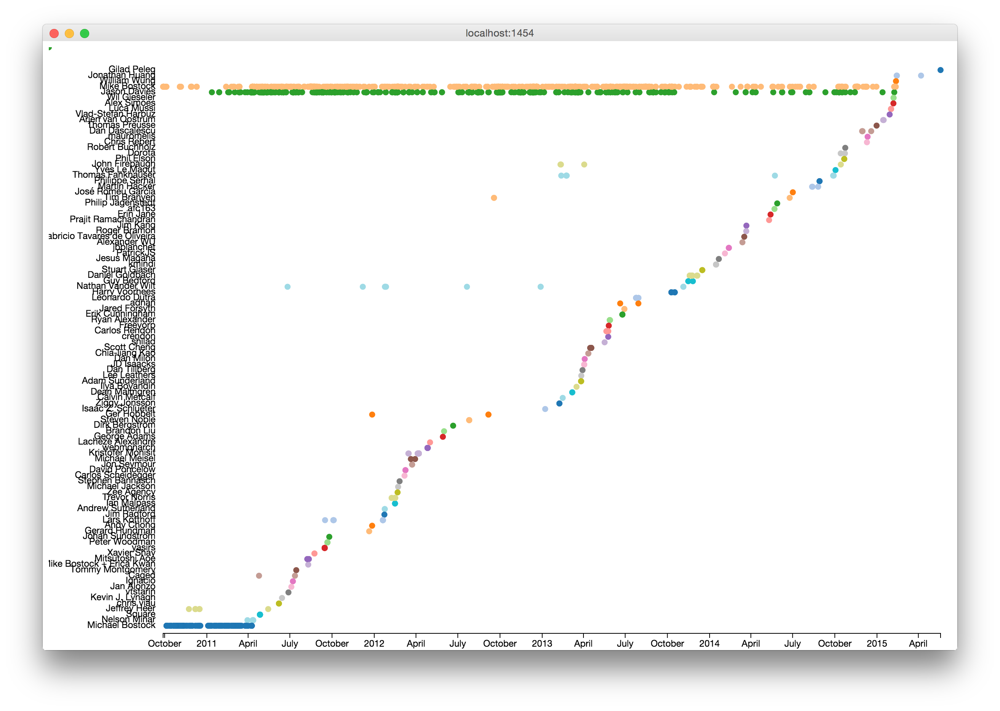

# Visualize the commits to a repo.

## Installation

    npm install show-commits -g

## To run

cd into a git directory.

    cd /Users/victorpowell/Documents/projects/show-commits

run show-commits

    show-commits

This will open a Chrome window in "app" mode (no toolbars and what not.)

When you're done, just quit the App or kill the process with `ctrl-c` (SIGINT) from the command line.

